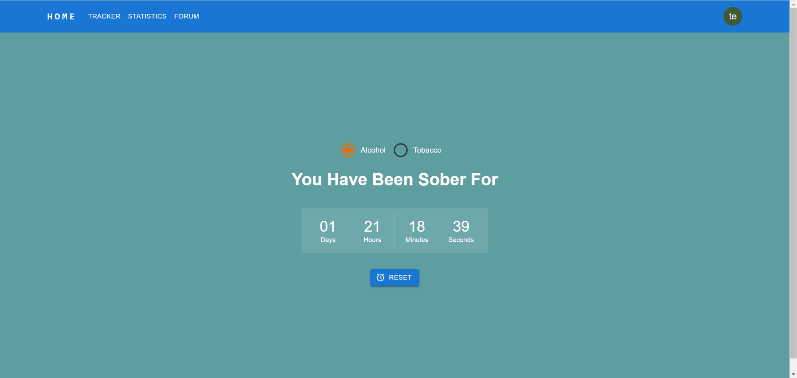
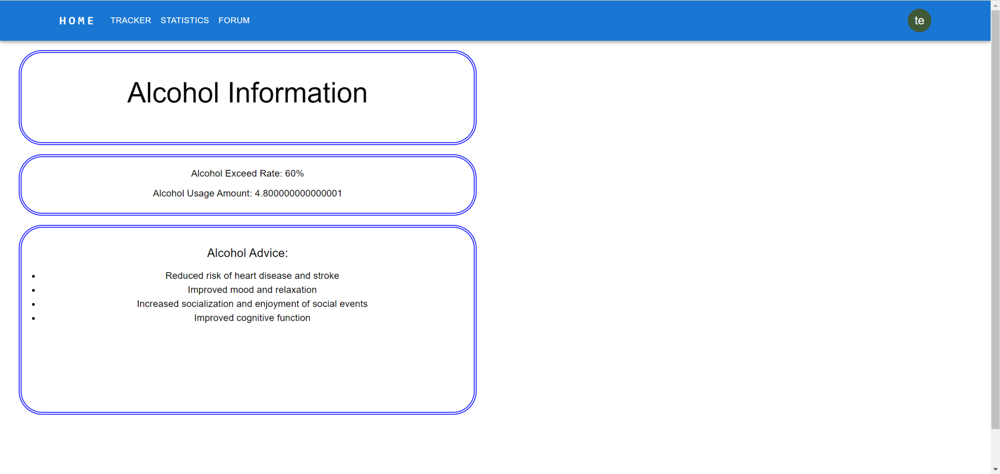
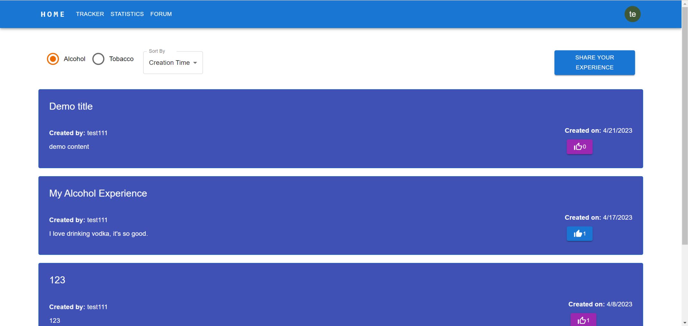

1. navigate to this URL https://amsober.com/ and click the "Register" bottom on the right top of the page. In the Register page, you can choose whether to be a tobacco/alcohol user.
2. After registering, you can use your username and password to login. After login. you can see the "Tracker" page which record your last alcohol/tobacco time. There is "reset" bottom for you to click if you want to reset your last alcohol/tobacco time to now. When reseting the time, you are required to provide the details of alcohol/tobacco.

3. If you click either the "Statistics Alcohol/Tobacco" page, you can find you detailed information, including the rate you consume alcohol/tobacco compared with others, the amount you have consumed and some advices.

4.  In the "FORUM" page, you can share your alcohol/tobacco experience by writing some posts. 
