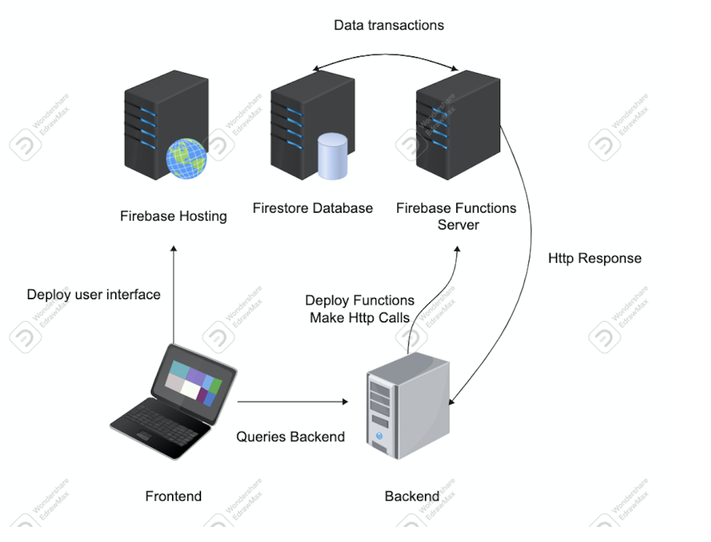

# Tools and Technology

Our project is an end-user web application with a frontend, a backend, and also a database containing user information and useful data.

## Frontend

- React with TypeScript
- Recoil.js (for state management)
- Material UI (for UI components)

## Backend

- Google Firebase Functions based on TypeScript

## Hosting Service

- Google Firebase

## Database

- Google Firestore

# Data/Sources

The majority of our data will be user data, which will be collected when users register for our services and use it to track alcohol & tobacco consumption.

The rest of data will be mainly collected from public health organizations like WHO, NIH, etc. This part will be used for health advice and tips to alcohol/tobacco consumers based on their consumption amount.

# Architecture Diagram

# User Manual

It is very easy to use our app! Simply go to the deployed website shown in Section II and you are all set!

**Quick Notice**: Currently, our Login and Register API has relatively higher latencies than other APIs. So please wait for 5-8 seconds after you hit login or register.
